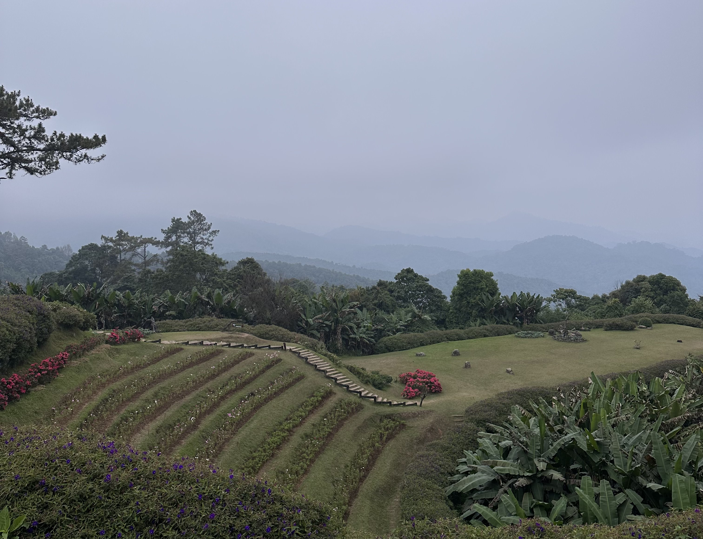

# v0.6 Huai Nam Dang



> Photo by <a href="https://instagram.com/destroooooya">Maria Goroshko</a>

::: details Why Huai Nam Dang?
Huai Nam Dang is a national park in the North of Thailand. It is one of the coldest places in Thailand (like 12 °C or 53 °F) 🥶
:::

It's pretty compact release with only one notable change - [`attachOperation`](/api/operators/attach_operation) which allows coping of [_Query_](/api/primitives/query) or [_Mutation_](/api/primitives/mutation) with altering parameters.

```ts
import { createStore } from 'effector';
import { attachOperation, createQuery } from '@farfetched/core';

const $externalStore = createStore(12);

const originalQuery = createQuery({
  handler: async (params: string) => 'some data',
});

const attachedQuery = attachOperation(originalQuery, {
  source: $externalStore,
  mapParams: (params: number, externalSource) =>
    (params + externalSource).toString(),
});
```

It also includes a couple of minor improvements and bug fixes. Read the full changelog below.

## Migration guide

Since [v0.5](/releases/0-5), Farfetched supports `@@unitShape` protocol, so you can use `useUnit` from `effector-react` and `effector-solid` to subscribe to custom entities like [_Query_](/api/primitives/query) and [_Mutation_](/api/primitives/mutation).

### Do not use `@farfetched/react`

Package `@farfetched/react` is deprecated, just use `useUnit` from `effector-react` instead of `useQuery` and `useMutation` 🪄

::: code-group

```tsx [before]
import { useQuery, useMutation } from '@farfetched/react';

function User() {
  const { data: user } = useQuery(userQuery);
  const { start: deleteAccount } = useMutation(deleteAccountMutation);

  return (
    <div>
      <p>Name: {user.name}</p>
      <button onClick={deleteAccount}>Delete my account</button>
    </div>
  );
}
```

```tsx [after]
import { useUnit } from 'effector-react';

function User() {
  const { data: user } = useUnit(userQuery);
  const { start: deleteAccount } = useUnit(deleteAccountMutation);

  return (
    <div>
      <p>Name: {user.name}</p>
      <button onClick={deleteAccount}>Delete my account</button>
    </div>
  );
}
```

:::

### Do not use `useMutation` from `@farfetched/solid`

Function `useMutation` from `@farfetched/solid` is deprecated, just use `useUnit` from `effector-solid` instead 🪄

::: code-group

```tsx [before]
import { createQueryResource, useMutation } from '@farfetched/solid';

function User() {
  const [user] = createQueryResource(userQuery);
  const { start: deleteAccount } = useMutation(deleteAccountMutation);

  return (
    <Suspense fallback={<p>Loading...</p>}>
      <div>
        <p>Name: {user().name}</p>
        <button onClick={deleteAccount}>Delete my account</button>
      </div>
    </Suspense>
  );
}
```

```tsx [after]
import { useUnit } from 'effector-solid';
import { createQueryResource } from '@farfetched/solid';

function User() {
  const [user] = createQueryResource(userQuery);
  const { start: deleteAccount } = useUnit(deleteAccountMutation);

  return (
    <Suspense fallback={<p>Loading...</p>}>
      <div>
        <p>Name: {user().name}</p>
        <button onClick={deleteAccount}>Delete my account</button>
      </div>
    </Suspense>
  );
}
```

:::

::: tip
Q: Why `createQueryResource` is still there?

A: Because `@@unitShape` protocol supports only shapes of units, not custom operations like binding [_Query_](/api/primitives/query) with Suspense of Solid.
:::

<!--@include: ./0-6.changelog.md-->
